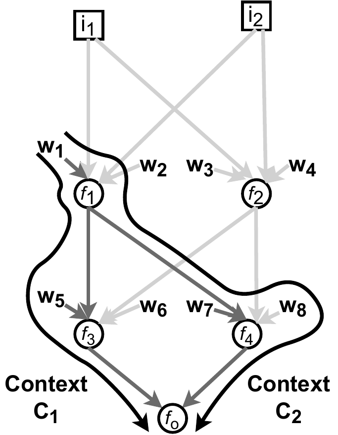
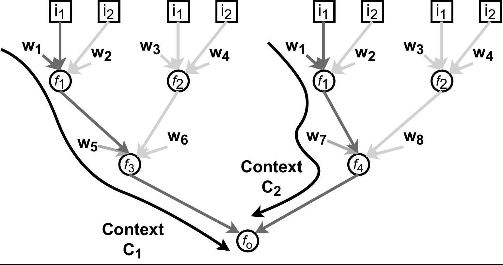
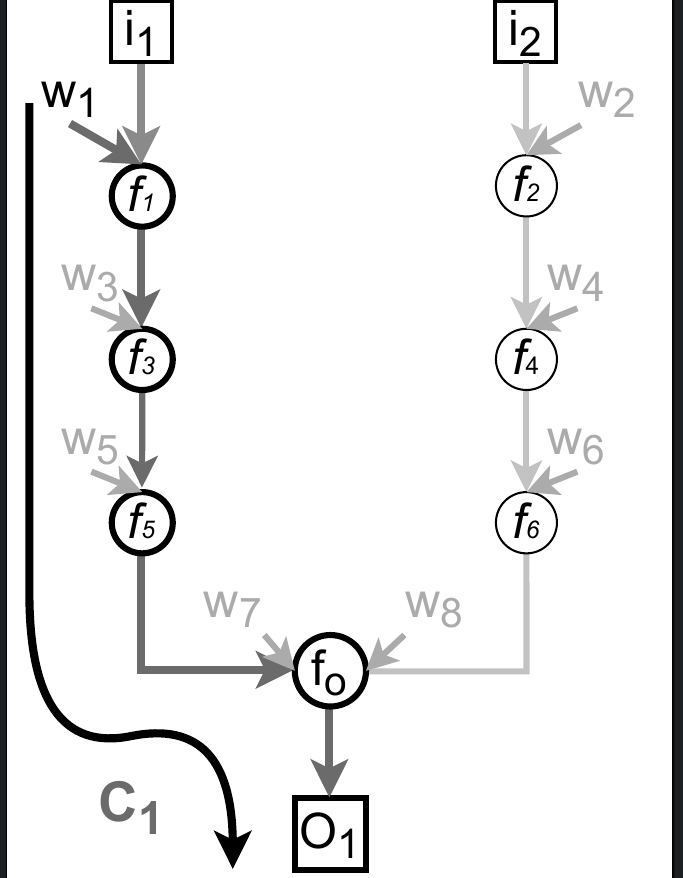
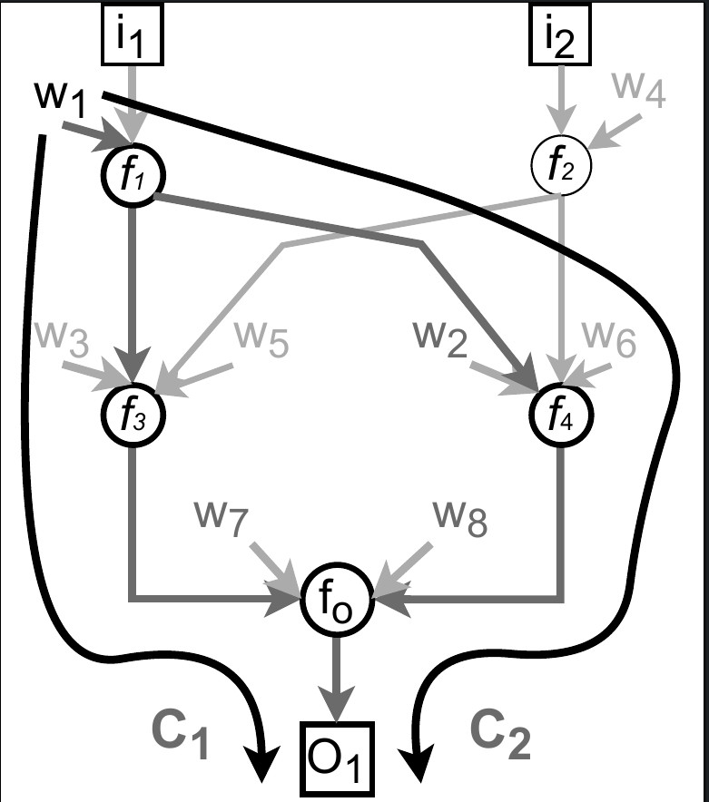

# The reusability prior
A library to analyze deep learning model graphs, estimate performance and compare models _without training_. 
Accepted paper is available [here](https://doi.org/10.1088/2632-2153/acc713).

Please cite as:

```
@article{polat10.1088/2632-2153/acc713,
	author = {POLAT, AYDIN and Alpaslan, Ferda},
	journal = {Machine Learning: Science and Technology},
	title = {The reusability prior: comparing deep learning models without training},
	url = {http://iopscience.iop.org/article/10.1088/2632-2153/acc713},
	year = {2023}
}
```

## What is the reusability prior?
We conjecture the expected number of __contexts__ for model components is the major reason for differences in model performance. We introduce the reusability prior as follows:

> Model components are forced to function in diverse contexts not only due to the training, data, augmentation, and regularization choices but also due to the model design itself. These aspects explicitly or implicitly impact the expected number of contexts for model components. Maximizing this number improves parameter efficiency for models of similar size and capacity. By relying on the repetition of reusable components, a model can learn to describe an approximation of the desired function more efficiently with fewer parameters.


## What is a context?


A context is a path from a parameter associated with an input to an output. $C_1$ is the bold path from $w_1$ associated with $i_1$ through functions $f_1$, $f_2$, .., $f_m$ contributing to the output $O_1$.  Note that $w_1$ can contribute to $O_1$ through multiple contexts (e.g. $C_1$ and $C_2$). Please see our paper (section 1.1) for a more formal definition.


## A simple counting approach


Frequencies (i.e. the number of contexts) of each learnable parameter in the above graph can be directly counted from the unrolled graph below:



Alternatively, our illustrative [code](reusability/graph/dag.py) for counting provides a simple but highly inefficient way to calculate the counts without horizontal unrolling:


```
def recursive_count(node):
   """Recursively count the usage of all source nodes"""
   node.count += 1

   for source in get_sources(node):
   	recursive_count(source)


def horizontal_unroll_count(leaf_nodes):
   """Recursively count the total number of contexts for all nodes"""

   for node in leaf_nodes:
   	recursive_count(node)
```
This leads to the following counts:
```
   w1: 2
   w2: 2
   w3: 2
   w4: 2
   w5: 1
   w6: 1
   w7: 1
   w8: 1
```

with the relative frequencies:
```
   p(w1): 1/6
   p(w2): 1/6
   p(w3): 1/6
   p(w4): 1/6
   p(w5): 1/12
   p(w6): 1/12
   p(w7): 1/12
   p(w8): 1/12
```

The recursive approach for counting has exponential complexity. For larger models, important optimizations were necessary for analysis. __We will release the optimized code that we used for all of our experiments after acceptance of our manuscript.__

## Quantities for model comparison

### Total surprisal
Total surprisal is defined as: $$S_G = - \sum_{i=1}^{N_G} {\log p(w_i)}$$  where ${N_G}$ is the number of learnable parameters.

In this example ${N_G}=8$ and $S_G = (4 * log2(6) + 4 * log2(12)) = 24.68$.

### Entropy
Entropy, or the expected surprisal, is defined as: $$H(W) = -\sum_{i=1}^{N_G} {p(w_i) \log p(w_i)}.$$

In this example $H(W) = (4 * 1/6 * log2(6) + 4 * 1/12 * log2(12)) = 2.92$.

### Expected spread
The expected spread is given by: $$E[\log_{2}|C|] = \sum_{i=1}^{N_G} p(w_{i}) \log_{2}|C_{w_{i}}|$$ where $|C_{w_i}|$ is the cardinality of the set of all contexts for $w_i$ (e.g. the counts we obtained from the horizontally unrolled graph).

In this example, $E[\log_{2}|C|] = 4 * 1/6 * log2(2) + 4 * 1/12 * log2(1) = 0.67$

### Total surprisal based performance estimation
We propose using the total surprisal for estimating the descriptive ability of a model, with the assumption that when other conditions are the same or similar, a model with a higher descriptive ability would perform better:

$P_G = \log_{2}\left(S_G  \frac{N_{I}}{|G|}\right)$ where $N_{I}$ the total number of input nodes and $|G|$ the summation of the total number of input, output and weight nodes.

In this example  $N_{I}=2$ and $|G|=2+1+8=11$ and $P_G = log2(24.68 * 2/11) = 2.17$

### Expected spread based performance estimation
As an alternative approach, we propose using the expected spread for estimating the descriptive reusability of a model, with the assumption that when other conditions are the same or similar, a model with higher descriptive reusability is more parameter efficient and would perform better:

$P_G = \log_{2}\left(N_G   E[\log_{2}|C| + 1] \frac{N_{I}}{|G|}\right)$

In this example  $N_{I}=2$ and $|G|=2+1+8=11$ and $P_G = log2((0.67 + 1) * 8 * 2/11) = 1.28$

## Comparing different graphs


We call graphs like above a __uniform graph__, where there is no parameter sharing, and each parameter has only a single context, hence horizontal unrolling leaves them the same. They always have the maximum entropy and an expected spread of zero.



Above graph depicts a second graph with the same number of parameters. It is not uniform as some parameters have more than one context.

For the uniform graph:

- The number of parameters: ${N_G}=8$,
- Input nodes: $N_{I}=2$
- Size: $|G|=2+1+8=11$
- Total surprisal: $S_G = 8 * log2(8) = 24.00$,
- Entropy: $H(W) = 8 * 1/8 * log2(8) = 3$ (which is the maximum possible entropy since $P(W)$ is uniform),
- Expected spread: $E[\log_{2}|C|] = 8 * 1/8 * log2(1) = 0$
- Total surprisal based performance estimation: $P_G = log2(24 * 2/11) = 2.13$
- Expected spread based performance estimation: $P'_G = log2((0.0 + 1) * 8 * 2/11) = 0.54$

For the second graph:

- The number of parameters: ${N_G}=8$,
- Input nodes: $N_{I}=2$
- Size: $|G|=2+1+8=11$
- Total surprisal: $S_G = 6 * log2(10) + 2 * log2(5) = 24.58$ as two parameters have two contexts and each of the rest has a single context,
- Entropy: $H(W) = 6 * 1/10 * log2(10) + 2 * 1/5 * log2(5) = 2.92$ (which is lower than the maximum possible entropy we saw from the uniform graph),
- Expected spread: $E[\log_{2}|C|] = 6 * 1/10 * log2(1) + 2 * 1/5 * log2(2) = 0.4$
- Total surprisal based performance estimation $P_G = log2(24.58 * 2/11) = 2.16$
- Expected spread based performance estimation $P'_G = log2((0.4 + 1) * 8 * 2/11) = 1.03$

The second graph has higher performance estimations, total surprisal, and expected spread.

## Conclusion
Overall, our framework allows comparing arbitrary directed acyclic graphs in a quantifiable way by relying on a simple counting approach. In practice we applied our technique to several EfficientNetv2 and ResNet-50 models and this approach was able to properly rank them according to their performance _without relying on any training_. More details are available in the paper.

Please cite this repository as:

```
@software{dlessence_2023_7805346,
	author       = {dlessence and
	Aydin Göze Polat},
	title        = {gozepolat/priors: The Reusability Prior},
	month        = apr,
	year         = 2023,
	publisher    = {Zenodo},
	version      = {v1.0.0},
	doi          = {10.5281/zenodo.7805346},
	url          = {https://doi.org/10.5281/zenodo.7805346}
}
```
